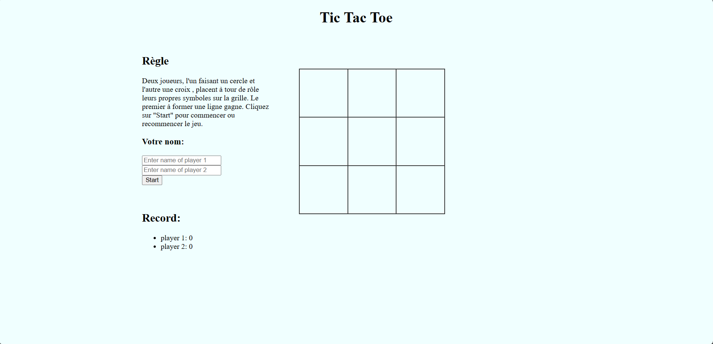
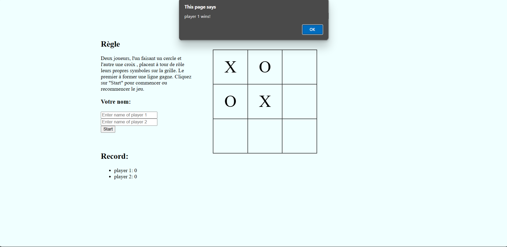
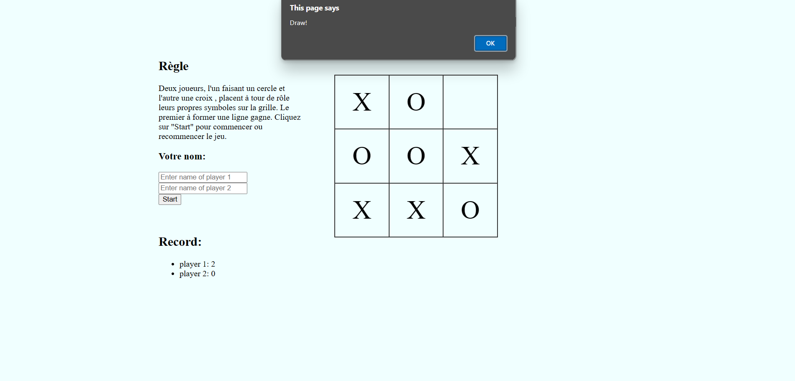

## Overview
This game is designed for two players and allows for entering player names and tracking their scores. The players can type their names to start. When they type their names again, the score will be zero and restart the game.

## When a player win

In this exemple, player 1 click the third cell of the third row.

## Draw

## Backgroud

couleur: azure

## Titre

| Attributs | Display                                                                 
|-----------|-----------
| couleur     | black            
| Emplacement | center    

## Cell
| Attributs | Display                                                                 
|-----------|-----------
|border     | 2px solid #333
|width      | 100px
|height     | 100px
|text-align | center
|vertical-align |middle
|cursor     |pointer
|font-size  |50px